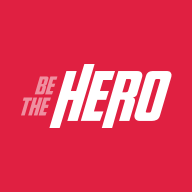

  

<h1 align="center">
  Be The Hero
</h1>

  
  
  

## :clipboard: Description
Application for connecting people and Non-governmental organization. building on 11th Week OmniStack of [Rocketseat](https://rocketseat.com.br/) with a lot of modifications. I enjoyed learning more of `Typescript` and `SCSS` in that project.

## 🧐 What's inside?

### Technologies
- `Backend` - Node.js
- `Mobile` - Reacte Native
- `Web` - ReactJS

### Linter tools
- [Eslint](https://eslint.org/)
- [Prettier](https://prettier.io/)
